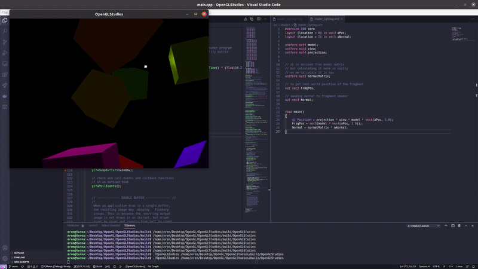
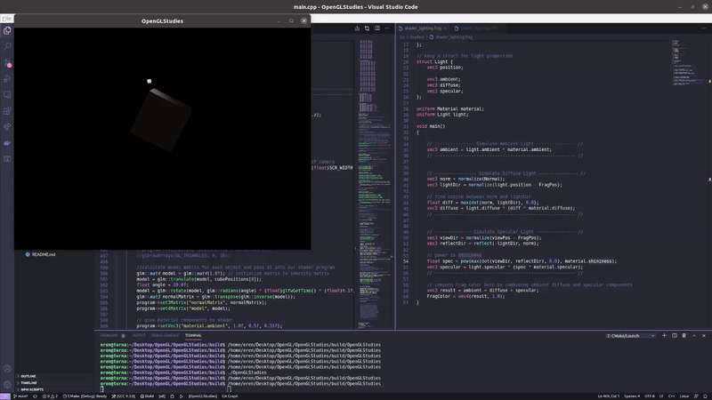
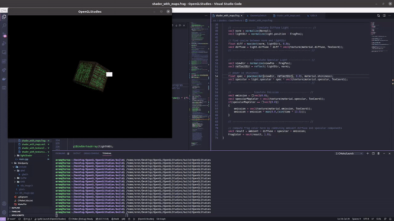

# OpenGLStudies
To be a real graphics programmer, I need to understand OpenGL really well. This repo will help me track where I left.

# Update 13th March 2021 - BASIC LIGHTING

Made some progress with basic stuff.

With playing materials

# Update 14th March 2021 - Diffuse, Specular and Emission Maps

Different textures for diffuse, specular and emissive properties have been implemented in shader and application. with time uniform, green emission is animated.

Later that day, I was able to implement directional, point and spot lights

# Midnight Update 15th March 2021 - Multiple Light sources

As in the tutorial

* there is one directional light
* one flashligt
* 4 point lights having different colors

# Midnight Update 19th March 2021 - First Model

Model and mesh classes implemented using Assimp library. I can load models and apply glsl shaders and use it with my point lights, directional light and flashlight. 

Now, I guess I need to dive in some advanced stuff in OpenGL. At least tutorial says that :D

# Midnight Update 23th March 2021 - New Model Types

Before diving into advanced stuff, I saw that I have to learn how to add new models instead of the modified one in the tutorial. New scene contains;

  *  davy jones    => Batuhan13 (https://sketchfab.com/Batuhan13)
  *  backpack      => Berk Gedik (https://sketchfab.com/berkgedik)
  *  bristleback   => Nikolay_Tsys (https://sketchfab.com/Tolst)
  *  sponza scene  => kevin.kayu (https://sketchfab.com/kevin.kayu)

# 2nd Midnight Update 23th March 2021 - Depth Buffer

I started learning depth buffers and rendered the previous scene with linearizing
z values of frag coordinates which is recorded by opengl itself

# I'm back!!!!! Update 1st January 2022 - Stencil Buffer

I had a lot of things to do. Meanwhile, I changed my job. Now I'm a TA at my university which means I've a lot more time to learn. I'm a bit late but back in track. I'm not giving up learning opengl. This time, I've handled stencil buffers!

# Update 3rd January 2022 - Blending (Transparent Windows)

I spent some time refactoring my code. In order to track the lessons I follow better, I started
storing code and data that is specific lessons separately so I can plug in any of them if I want.

This time, I have learnt how to do blending.

# Update 4th January 2022 - FaceCulling

This time, I've studied face culling part in [LearnOpenGL](https://learnopengl.com/Advanced-OpenGL/Face-culling) and finished the excercise. In this exervise, I re-defined vertex data of the cube specifying each triangle in clockwise order and rendered the scene with clockwise triangles set as the front faces.

It looks like how we see inside of buildings and rooms in games like sims :D

# Update 6th January 2022 - Framebuffers and Post Processing

Now I have learnt how to create framebuffers and apply post processing to them.

Like applying edge detection;

Or Gaussian Blur;

# Update 8th January 2022 - Skyboxes and Environment Mapping

I have finished skyboxes and environment mapping parts and understood how they are done.

